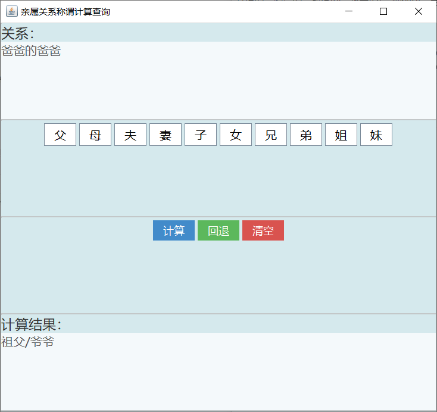

# RelationshipCalculator_swing
## 项目介绍

亲戚关系计算器，通过swing实现。

运行界面如下：

## 参考链接

[Java实战之亲戚关系计算器（swing版）（1）——项目简述](http://mp.weixin.qq.com/s?__biz=MzU4MDc0NDI0NQ==&mid=2247484207&idx=1&sn=fba3ae5f6ca5429f6096b2a16ded4cbe&chksm=fd536675ca24ef630c6039f5f8aa1b422ad499c501dbdfadc7abee09391f7c3e5ae47b60760d&scene=21#wechat_redirect)

[Java实战之亲戚关系计算器（swing版）（2）——功能介绍](http://mp.weixin.qq.com/s?__biz=MzU4MDc0NDI0NQ==&mid=2247484208&idx=1&sn=73811094fb53124d7d4e81beae2268de&chksm=fd53666aca24ef7c466c416ce5cf1f12187aa3863185e57c6a4381c236d62a34ce80fb25bed8&scene=21#wechat_redirect)

[Java实战之亲戚关系计算器（swing版）（3）——界面设计](http://mp.weixin.qq.com/s?__biz=MzU4MDc0NDI0NQ==&mid=2247484210&idx=1&sn=6e4aa8ca781eea0d4ce2affcddb28e27&chksm=fd536668ca24ef7e63473bf4ceb12a29c4e1bdcd96d660f32e889f31bf951bffaa8f5bd4ba17&scene=21#wechat_redirect)

[Java实战之亲戚关系计算器（swing版）（4）——界面装饰](http://mp.weixin.qq.com/s?__biz=MzU4MDc0NDI0NQ==&mid=2247484212&idx=1&sn=a8851041ada7d6ab84d902f265eb91da&chksm=fd53666eca24ef78e3a72e63a99f807f1bdc5d580872cb03ff6aec940dc6fbae80079f3b69ee&scene=21#wechat_redirect)

[Java实战之亲戚关系计算器（swing版）（5）——回退及清空功能](http://mp.weixin.qq.com/s?__biz=MzU4MDc0NDI0NQ==&mid=2247484214&idx=1&sn=0a179fa2d68c8d08274eb7a89c606d79&chksm=fd53666cca24ef7aa87cc68e0a6418932d228bc4fc347c8903434cd74c1cd529fb57e9791986&scene=21#wechat_redirect)

[Java实战之亲戚关系计算器（swing版）（6）——实现计算功能](http://mp.weixin.qq.com/s?__biz=MzU4MDc0NDI0NQ==&mid=2247484216&idx=1&sn=ef5e8eeebfdda1c7c75a0d9574ec9908&chksm=fd536662ca24ef74f4effab57e027fcf85d4e5e4199e2c76be4d9c23f46f64cffad524aa1676&scene=21#wechat_redirect)